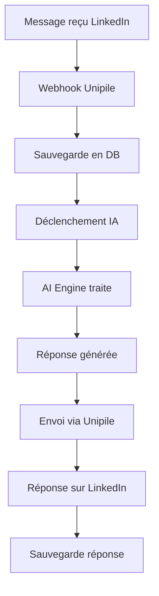

# 🤖 Guide d'Intégration IA - LinkedInProspector

## ✅ Intégration terminée !

L'intégration entre les webhooks Unipile et l'AI Engine est maintenant **fonctionnelle** ! Voici comment finaliser la configuration.

## 🚀 Configuration des clés API

### 1. Obtenir les clés API

#### OpenAI (Recommandé)
```bash
# Aller sur https://platform.openai.com/api-keys
# Créer une nouvelle clé API
# Copier la clé (commence par sk-proj-...)
```

#### Claude (Optionnel)
```bash
# Aller sur https://console.anthropic.com/
# Créer une nouvelle clé API
# Copier la clé (commence par sk-ant-...)
```

#### Mistral (Optionnel)
```bash
# Aller sur https://console.mistral.ai/
# Créer une nouvelle clé API
# Copier la clé
```

### 2. Configurer les variables d'environnement

Éditez votre fichier `.env` :

```env
# OpenAI (OBLIGATOIRE pour les réponses automatiques)
OPENAI_API_KEY=sk-proj-votre-clé-openai-ici

# Claude (OPTIONNEL)
CLAUDE_API_KEY=sk-ant-votre-clé-claude-ici

# Mistral (OPTIONNEL)
MISTRAL_API_KEY=votre-clé-mistral-ici
```

## 🛠️ Démarrage des services

### 1. Démarrer tous les services
```bash
# Démarrer tous les microservices
npm run dev

# Ou démarrer individuellement
npm run dev:backend    # Port 3000
npm run dev:ai         # Port 3001
npm run dev:queue      # Port 3002
npm run dev:frontend   # Port 3003
```

### 2. Vérifier que tout fonctionne

```bash
# Vérifier le backend
curl http://localhost:3000/health

# Vérifier l'AI Engine
curl http://localhost:3001/health

# Vérifier la connexion Unipile
curl http://localhost:3000/api/channels/unipile/accounts
```

## 🔧 Test des réponses automatiques

### 1. Connecter un canal LinkedIn

```bash
curl -X POST http://localhost:3000/api/channels \
  -H "Content-Type: application/json" \
  -H "Authorization: Bearer YOUR_JWT_TOKEN" \
  -d '{
    "name": "LinkedIn Justine",
    "type": "LINKEDIN",
    "provider": "unipile",
    "credentials": {
      "account_id": "UPTia34MReunGaiOqtyrSQ"
    }
  }'
```

### 2. Tester la réponse automatique

1. **Envoyer un message** à votre compte LinkedIn depuis un autre profil
2. **Vérifier les logs** du backend pour voir l'IA en action :
   ```bash
   # Dans le terminal où tourne le backend
   # Vous devriez voir :
   # [INFO] AI response triggered
   # [INFO] AI response sent successfully
   ```

3. **Voir la réponse** générée automatiquement dans LinkedIn

## 📊 Monitoring et debugging

### Logs détaillés
```bash
# Activer les logs debug
LOG_LEVEL=debug npm run dev
```

### Vérifier les réponses IA
```bash
# Tester directement l'AI Engine
curl -X POST http://localhost:3001/process \
  -H "Content-Type: application/json" \
  -d '{
    "message": "Bonjour, pouvez-vous me parler de vos services ?",
    "agentConfig": {
      "type": "SALES",
      "model": "gpt-4o",
      "temperature": 0.7
    },
    "context": {
      "channelType": "LINKEDIN"
    }
  }'
```

## 🎯 Personnalisation des réponses

### Modifier le prompt LinkedIn

Éditez `backend/src/services/ai-engine.service.ts` ligne ~130 :

```typescript
prompt: `Tu es un assistant commercial expert en prospection LinkedIn. 

Ton rôle :
- Répondre de manière professionnelle et engageante
- Poser des questions pertinentes pour qualifier le prospect
- Maintenir un ton convivial mais professionnel
- Personnaliser selon le profil du prospect

Règles importantes :
- Maximum 2-3 phrases
- Toujours finir par une question
- Éviter d'être trop commercial
- Adapter selon le contexte`
```

### Ajouter des agents spécialisés

Créez de nouveaux agents dans `ai-engine/src/agents/` :

```typescript
// ai-engine/src/agents/recruitmentAgent.ts
export class RecruitmentAgent extends BaseAgent {
  getSystemPrompt(): string {
    return `Tu es un recruteur expert...`;
  }
}
```

## 🔄 Workflow complet



## 🚨 Dépannage

### Problème : Pas de réponse automatique

1. **Vérifiez les logs** :
   ```bash
   tail -f backend/logs/combined.log
   ```

2. **Vérifiez la clé OpenAI** :
   ```bash
   curl -H "Authorization: Bearer $OPENAI_API_KEY" \
     https://api.openai.com/v1/models
   ```

3. **Vérifiez l'AI Engine** :
   ```bash
   curl http://localhost:3001/health
   ```

### Problème : Réponses de mauvaise qualité

1. **Ajustez la température** (0.1 = plus précis, 0.9 = plus créatif)
2. **Modifiez le prompt** selon vos besoins
3. **Changez de modèle** (gpt-4o vs gpt-4o-mini)

### Problème : Trop de réponses automatiques

1. **Ajoutez des conditions** dans `triggerAIResponse()` :
   ```typescript
   // Ne répondre qu'aux nouveaux contacts
   if (message.conversation.messages.length > 3) {
     return; // Skip si conversation déjà établie
   }
   ```

## 📈 Prochaines étapes

1. **Intégration Queue Service** pour les réponses différées
2. **Tableau de bord** pour monitorer les performances IA
3. **A/B Testing** des différents prompts
4. **Intégration CRM** pour qualifier les prospects

## 🎉 Félicitations !

Votre assistant IA LinkedIn est maintenant **opérationnel** ! 

- ✅ Réponses automatiques configurées
- ✅ Intégration Unipile fonctionnelle
- ✅ Monitoring et logs en place
- ✅ Personnalisation possible

**Prêt à révolutionner votre prospection LinkedIn ! 🚀** 